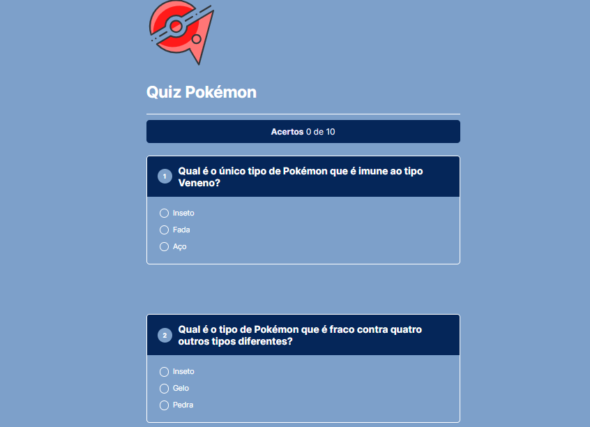

<h1 align="center"> Quiz Pokémon </h1>

Programa efeito para testar os conhecimentos dos fãns       .  

  <a href="#-tecnologias">Tecnologias</a>&nbsp;&nbsp;&nbsp;|&nbsp;&nbsp;&nbsp;
  <a href="#-projeto">Projeto</a>&nbsp;&nbsp;&nbsp;|&nbsp;&nbsp;&nbsp;
  <a href="#memo-licença">Licença</a>

  

 

  

## 🚀 Tecnologias

Esse projeto foi desenvolvido com as seguintes tecnologias:

- HTML e CSS
- JavaScript
- Git e Github

## 💻 Projeto

Esse quiz foi feita para testar e ensinar os fãns e as pessoas que queiram fazer.

- [Acesse o projeto finalizado, online](https://github.com/KaueACLima/projeto-discover-dev-links)

- [Acesse o portifólio finalizado](https://github.com/KaueACLima/projeto-nlw-quiz)

## :memo: Licença

Esse projeto está sob a licença MIT.

---

Feito com ♥ by Kauê Lima :wave: [Meu linkedin:](https://www.linkedin.com/in/kau%C3%AA-lima-234515182/)

